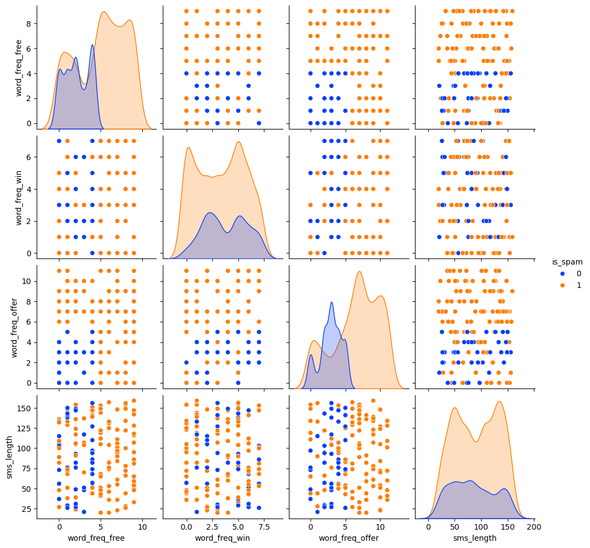

# 📩 SMS Spam Detection using Naïve Bayes  

---

## 🔍 Project Overview
This project is a **Machine Learning application** that classifies SMS messages as **Spam (1)** or **Not Spam (0)**.  
It uses a **Gaussian Naïve Bayes classifier** trained on SMS features like the frequency of suspicious words (`free`, `offer`, `win`) and message length.  

✨ Achieved an accuracy of **94.75%** on test data.  

---

## 📊 Visualizations
### 1️⃣ Feature Distribution (Bell Curve)  
We visualized the distribution of word frequencies (`free`, `offer`, `win`) across spam and non-spam messages.  
### 1️⃣ Feature Distribution

### 2️⃣ Streamlit App UI

---

## ⚙️ How It Works
1. **Data Preprocessing**  
   - Cleaned and structured SMS data.  
   - Extracted features such as word frequencies and SMS length.  
   - Verified bell-shaped (Gaussian-like) distributions for continuous features.  

2. **Model Building**  
   - Used **Gaussian Naïve Bayes (GNB)** since the features are continuous.  
   - Trained the model with scikit-learn.  
   - Saved the model as `spam_model.sav` using pickle.  

3. **Deployment**  
   - Created a Streamlit application (`app.py`).  
   - User enters word frequencies & message length → model predicts Spam / Not Spam.  

---

## 🚀 Run Locally

### 🔹 1. Clone the Repository

git clone https://github.com/YOUR_USERNAME/sms-spam-naive-bayes.git
cd sms-spam-naive-bayes

2. Install Dependencies
pip install -r requirements.txt

3. Run the App
streamlit run app.py

🧠 Tech Stack

Python

Pandas, NumPy

Scikit-learn

Streamlit (for deployment)

Matplotlib / Seaborn (for visualization)

📈 Results

Accuracy: 94.75%

Model: Gaussian Naïve Bayes

Best features: word_freq_offer, word_freq_free

🌐 Live Demo

# 📩 SMS Spam Detection App

👉 [Click here to try the App](https://spam-detection-using-naive-bayes-2da2r9akyve3ubvctpjcua.streamlit.app/)
